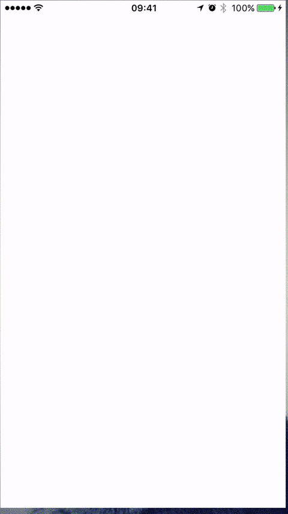

# Timeline Animations

A powerfull wrapper around CoreAnimation that facilitates the sequencing of animations.

## Timeline
A Timeline is a group of animations (CAAnimation) (or other timeline animations) that form a logical animation sequence.

## Features 

- You can **Pause**, **Resume**, and **Cancel** a Timeline animation
- Easily **replay** a finished animation
- **Repeat** timeline animations with block based callback between iterations
- **Reverse** whole timeline animations
- Add animation either sequentially (append) or at a certain time. Animations can overlap
- **Change speed**, even when the animation is playing. 
- **Mix** the above: repeat, pause, resume, accelerate/deccelarte and reverse all at once (or any combination)!
- Block based API for `.onStart` and `.completion` of an animation
- Block based API for `.onStart` and `.completion` of an entire timeline
- Use Timeline animations backed by CADisplayLink with `.onUpdate` block callback
- ARC enabled
- Sets the model values (optional) of the CALayer before starting the animation based on [Thoughts on removedOnCompletion in SparkRecordingCircle](https://gist.github.com/d-ronnqvist/11266321)

## Example

To run the example project, clone the repo, and run `pod install` from the Example directory first.

### Visual
This is a group timeline animation `gtl` consisted of:

- a center group timeline animation that repeat 2 times and:
  + has a timeline at time 0 for the brown view that oscillates vertically from top to bottom with a `CAKeyframeAnimation`
  + has a timeline at time 0 for the purple view that oscillates horizantally from left to right with a `CAKeyframeAnimation`
- another group timline that makes the red, green and blue views circulate around the screen

Sequence:

- **Play** `gtl`
- When `gtl` completes, play the **reverse** of `gtl` called `rgtl`. this makes the red, green and blue view animate backwards
- On completion of the reversed animation **replay** `gtl`



### Othe code example
Move a view from the top left to the middle left.
While animating **pause** and then **resume**.

```
UIView *view = [[UIView alloc] initWithFrame:CGRectMake(0,0,100,100)];
view.backgroundColor = [UIColor redColor];
// add as subview
// ...

// create a CABasicAnimation that moves a view from top to center
CABasicAnimation *ba = [AnimationsFactory animateWithKeyPath:kAnimationKeyPathPositionY
	                                                 toValue:@(CGRectGetHeight(self.view.bounds)-diameter)
    	                                            duration:3
        	                                  timingFunction:(ECustomTimingFunctionLinear)];

TimelineAnimation *timeline = [[TimelineAnimation alloc] init];

// set the model values of the CALayer before starting the animation and perfom the animaiton in reverse
// see https://gist.github.com/d-ronnqvist/11266321                                          
timeline.setsModelValues = YES;

// add the animation in the timeline and indicate the layer concerned
[timeline insertAnimation:ba
                  forLayer:view.layer
                    atTime:.5
                onComplete:nil];
[timeline play];

// pause and resume the animation
dispatch_after(dispatch_time(DISPATCH_TIME_NOW, (int64_t)(1 * NSEC_PER_SEC)), dispatch_get_main_queue(), ^{
    [timeline pause];
    dispatch_after(dispatch_time(DISPATCH_TIME_NOW, (int64_t)(.5 * NSEC_PER_SEC)), dispatch_get_main_queue(), ^{
        [timeline play];
    });
});
```
    
    
    
## Installation

TimelineAnimations is available through [CocoaPods](http://cocoapods.org). To install
it, simply add the following line to your Podfile:

```ruby
pod 'TimelineAnimations'
```


# Contributing
By contributing to TimelineAnimations, you agree that your contributions will be licensed under its MIT license.


## Author

Georges Boumis, boumis@abzorbagames.com
	
	
# License
This code is MIT-licensed.


# Future work

- ~~Support Swift~~
- ~~Make it a framework for > iOS 8 deployment targets~~
### Future work/ideas for version 3.0
Rewrite using an abstract interface. This will be version 3.0.
Something along the lines:

```swift
protocol TimelineAnimation {
  func play()
  func pause()
  func clear()
}
```

This approach permits to create decorators and extend the core functionality of this framework.


## License

TimelineAnimations is available under the MIT license. See the LICENSE file for more info.


